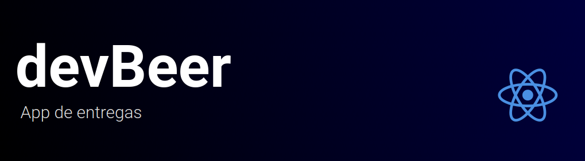
<br />

# :pushpin: Índice
- [Mídia](#camera_flash-mídia)
- [Sobre](#monocle_face-sobre)
- [Tecnologias](#rocket-tecnologias)
- [Instalação](#hammer_and_wrench-instalação)
- [Autores](#closed_book-autores)
<br />

---

Projeto desenvolvido em grupo e tem como objetivo ser um sistema de entrega de bebidas.

--- 

# :camera_flash: Mídia

Registrando novo usuário (cliente)
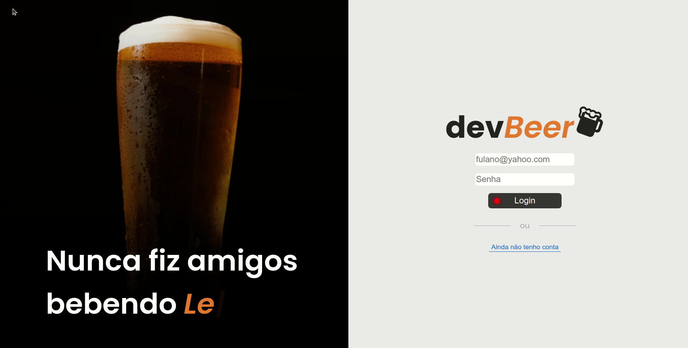

Fazendo pedido (cliente)
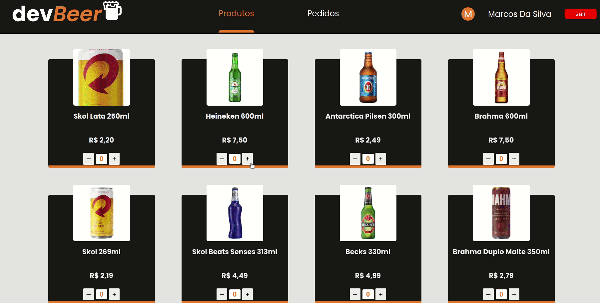

Recebendo pedido (pessoa vendedora)
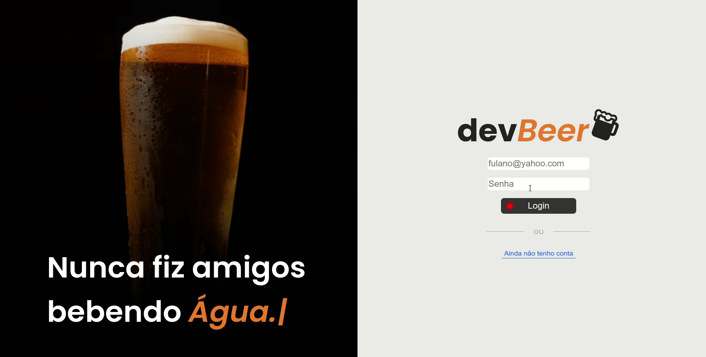

Marcando como recebido (cliente)
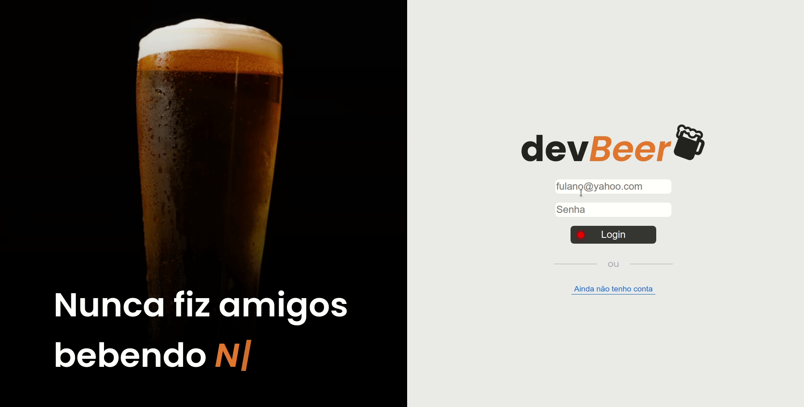

---

Login
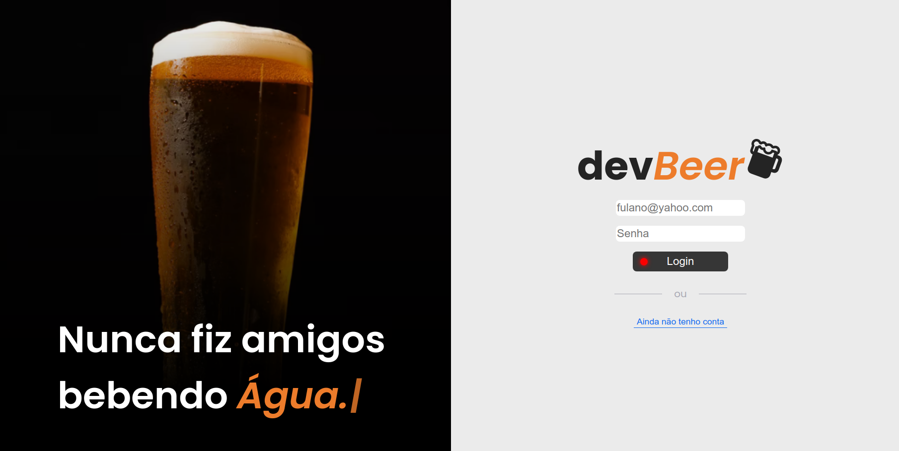

Registro
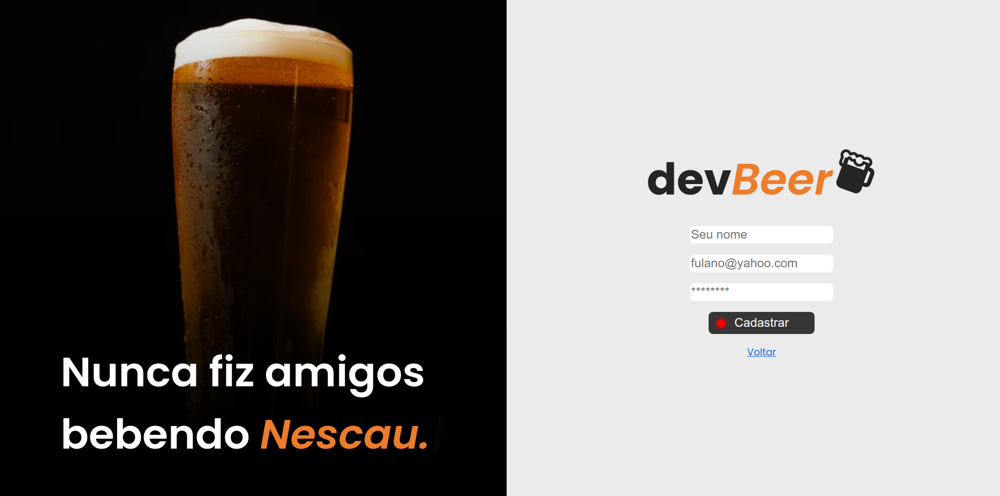

Produtos
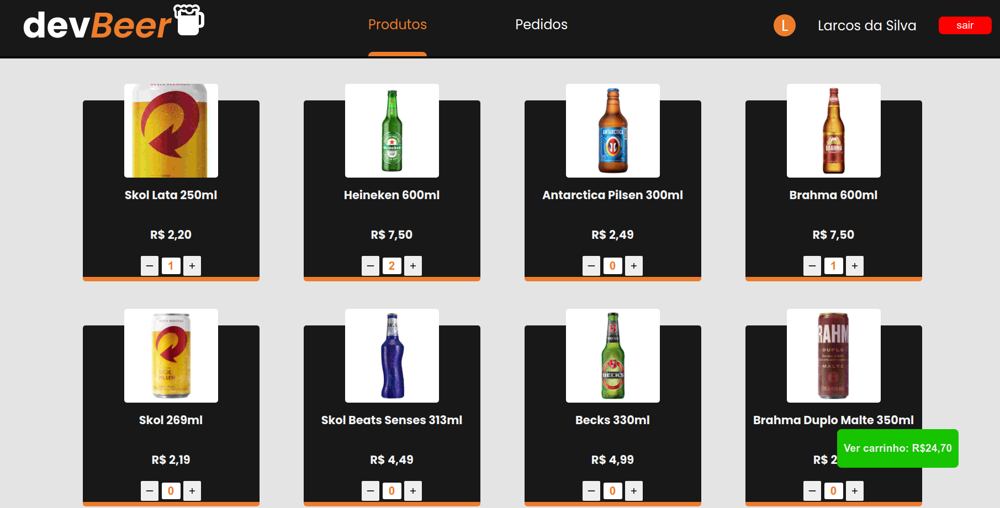

Carrinho
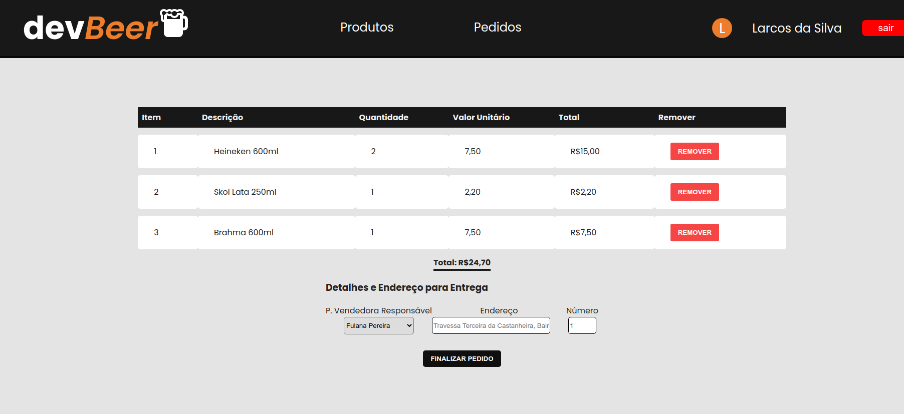

Pedidos
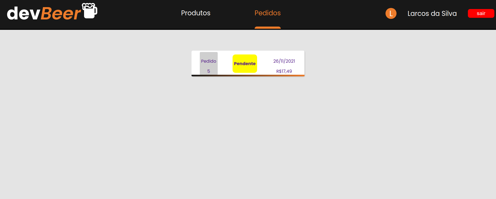

Detalhes do pedido
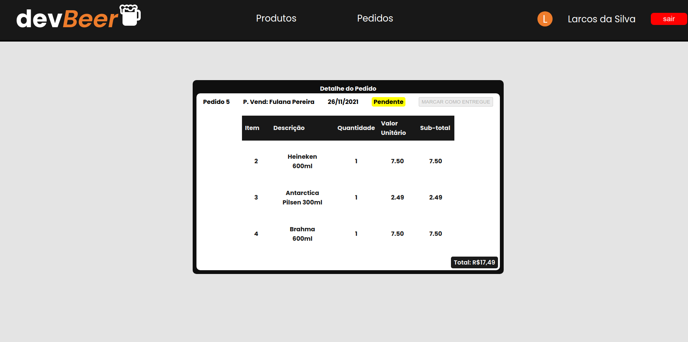

Pedidos - Visão do vendedor
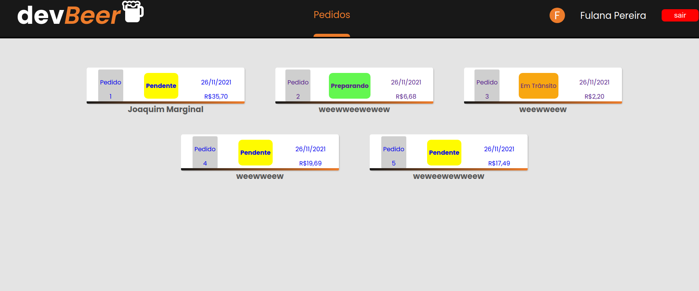

Detalhes do pedido - Visão do vendedor
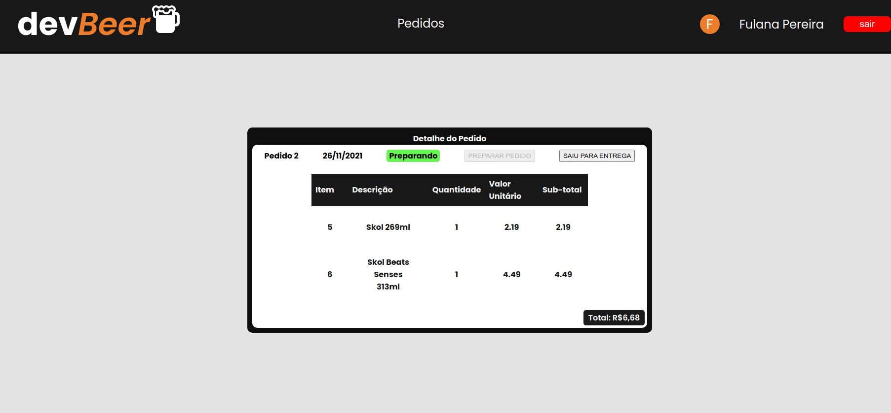

<br />

---
# :monocle_face: Sobre
Resumidamente existem 2 tipos de cadastros no banco de dados, cliente e pessoa vendedora.

Qualquer registro vindo pela rota comum daria como resultado um cliente normal, e pessoas vendedoras podem ser registratas diretamente no banco (ou no futuro por um admin).

As bebidas são consumidas por uma API fictícia.
Gerenciamento de estado utilizando Context API, Hooks e Storage.
Na parte de Banco de Dados foi utilizado MySQL em conjunto com o ORM Sequelize.

Alguns testes foram feitos tanto no back-end quanto no front-end.
<br />

---

# :rocket: Tecnologias
Esse projeto foi feito utilizando as seguintes tecnologias: <br>
- :heavy_check_mark: **React**
- :heavy_check_mark: **ContextAPI**
- :heavy_check_mark: **Hooks**
- :heavy_check_mark: **Node**
- :heavy_check_mark: **Express**
- :heavy_check_mark: **MySQL**
- :heavy_check_mark: **Sequelize**
- :heavy_check_mark: **ESLint**
- :heavy_check_mark: **Jest / RTL**
<br><br>
<br />

---

# :hammer_and_wrench: Instalação
**Esse projeto envolve variáveis ambientes, tenha certeza de que você as possui antes de tentar executar!**

1. Clone o repositório

```bash
git clone git@github.com:PatrickMoraisN/devBeer.git
```

2. Mude para o repositório do projeto

```bash
cd devBeer
```

3. Mude para o diretório de `back-end`

```bash
cd back-end
```

4. Crie um arquivo `.env` na raíz do diretório `back-end`

```bash
## MYSQL

***Deverá ter o MySQL instalado***

MYSQL_HOST=localhost
MYSQL_PORT=3306
MYSQL_USER=SEU_USUÁRIO_MYSQL
MYSQL_PASSWORD=SUA_SENHA_SQL
MYSQL_DB_NAME=delivery-app

## Server

NODE_ENV=development
API_PORT=3001
EVAL_ALWAYS_RESTORE_DEV_DB=true
```

5. Instale as dependências

```bash
npm install
```

6. Inicie o servidor `back-end` e deixe rodando

```bash
npm run dev
```

7. Em outro terminal, mude para o diretório `front-end`

```bash
cd front-end
```

8. Instale as dependências

```bash
npm install
```

9. Inicie o `front-end`

```bash
npm start
```

Ta tudo pronto! Abra em localhost:3000 para ver o app!
Esperamos que goste :)

---

# :closed_book: Autores
<div style="display:flex;justify-content:space-between">

Patrick Morais <br>
[](https://www.linkedin.com/in/patrick-morais/)<br>
[](mailto:ppternunes@gmail.com)<br>
[](https://www.github.com/patrickmoraisn/)

Marcelo (Tchelo) Maurício <br>
[](https://www.linkedin.com/in/marcelo-mauricio-jr/)<br>
[](mailto:mmauricio.design@gmail.com)<br>
[](https://github.com/mbmauriciojr)

Gabriel Pereira <br>
[](https://www.linkedin.com/in/gabrielpereiraalvesmoreira/)<br>
[](mailto:g.pereira.a.m@gmail.com)<br>
[](https://github.com/Gbl97)

</div>
